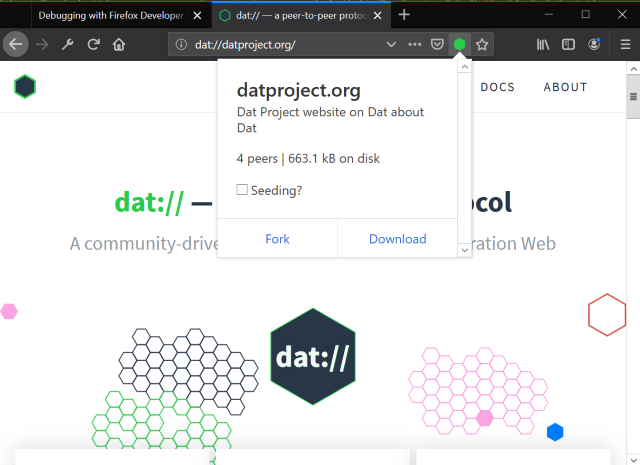
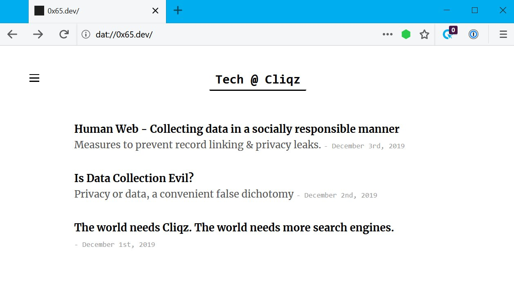

# Dat protocol support in Firefox

[@sammacbeth][] combined [libdweb](./libdweb) with [random-access-idb-mutable-file][] and few [libdweb adapters][] to get [dat implementation][] running in Firefox web extension context. This [brought `dat://` protocol support][dat-for-firefox-2] into Firefox through [dat-webext][] web extension. Which also provides [Beaker Browser][] [APIs][beaker docs] for the interoperability.

Dat site loaded in Firefox

The [dat-webext][] also works in [Cliqz][] browser.

Dat site loaded in Cliqz

[@sammacbeth]:https://github.com/sammacbeth "Sam Macbeth"

[Cliqz]: https://cliqz.com/ "Cliqz browser with built-in search engine"
[Mozilla reference browser]:https://github.com/mozilla-mobile/reference-browser/ "A full-featured browser reference implementation using Mozilla Android Components"
[libdweb]:https://github.com/mozilla/libdweb "Experimental Firefox extension APIs for P2P"

[Beaker Browser]:https://beakerbrowser.com/ "Experimental browser fo the peer-to-peer Web"

[random-access-idb-mutable-file]:https://github.com/random-access-storage/random-access-idb-mutable-file
[libdweb adapters]:https://github.com/libdweb
[dat implementation]:https://github.com/datproject/dat-node
[beaker docs]:https://beakerbrowser.com/docs/
[dat-for-firefox-2]:https://sammacbeth.eu/blog/2019/05/12/dat-for-firefox-2.html
[dat-webext]:https://github.com/cliqz-oss/dat-webext
[Beaker Browser]:https://beakerbrowser.com

