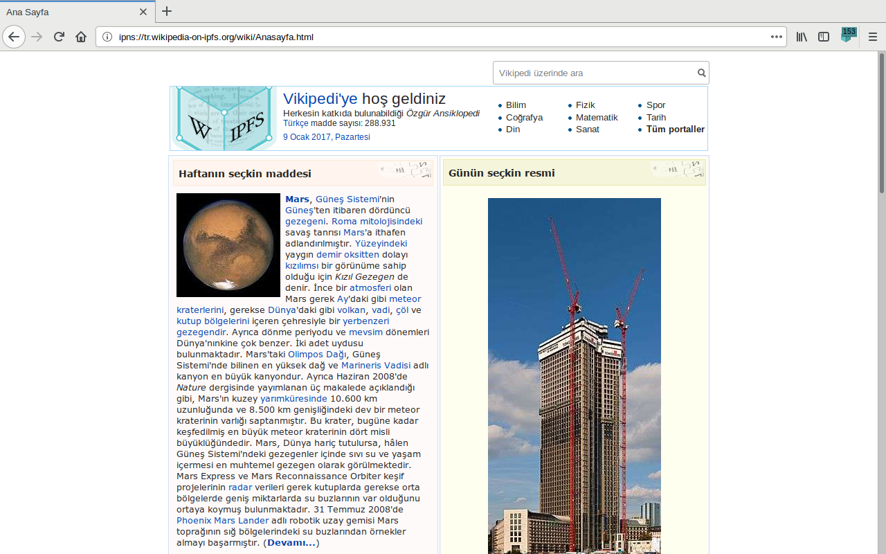

# IPFS protocol support in Firefox

[I have collaborated with IPFS][ipfs-collaboration]  team to integrate [libdweb](./libdweb) into [IPFS Companion][] Firefox extension. This made it possible to get a fully functional IPFS node in Firefox with a support for `ipfs://` URLs.

Turkish Wikipedia loaded from IPFS URL in Firefox

This inspired [Brave browser][] to develop [libdweb](./libdweb) like extension APIs to get IPFS protocol support. 

Content loaded from IPFS URL in Brave

[Opera web browser][] also since have announced plans to [add support for IPFS protocol][ipfs-opera].

[ipfs-collaboration]:https://blog.ipfs.io/2019-10-08-ipfs-browsers-update/#firefox
[IPFS Companion]:https://addons.mozilla.org/en-US/firefox/addon/ipfs-companion/
[Brave browser]:https://brave.com/
[Opera web browser]:https://www.opera.com/
[ipfs-opera]:https://blog.ipfs.io/2019-10-08-ipfs-browsers-update/#opera

