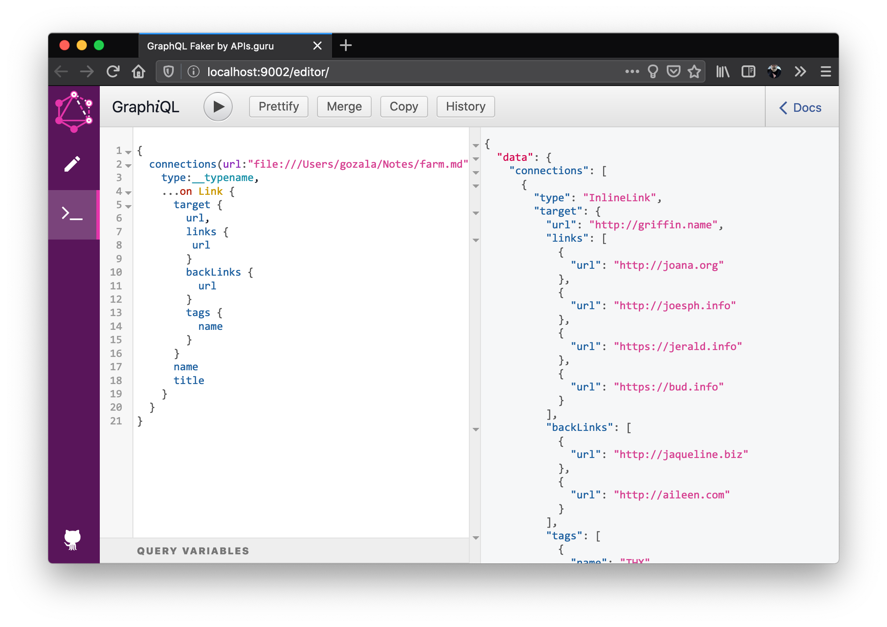

# March 20

Still thinking about resource relations and db schema. Seeing reflection of [RDF][] really scares me. Projecting db tables in attempt to gather some insights. [BLA][]

#### Resources

| RES_ID | URL                                           |
| ------ | --------------------------------------------- |
| 1      | file:///Users/gozala/Notes/farm.md            |
| 2      | https://www.inkandswitch.com/local-first.html |
| 3      | https://automerge.github.io/                  |
| 4      | ksp://markdown/ref-link                       |
| 5      | ksp://markdown/inline-link                    |
| 6      | ksp://tag/local-first                         |

#### Connections

_Will be IDs but projecting actual data instead_

| FROM_RES_ID         | TO_REST_ID                   | REL_ID                     |
| ------------------- | ---------------------------- | -------------------------- |
| file:///.../farm.md | https://.../local-first.html | ksp://markdown/ref-link    |
| file:///.../farm.md | https://automerge.github.io/ | ksp://markdown/inline-link |
| file:///.../farm.md | https://.../local-first.html | ksp://tag/local-first      |

From this data we can infer following:

- `farm.md` (reference) linked to `local-first.html`.
- `farm.md` (inline) linked to `automerge.github.io`.
- `local-first.html` (reference) back-linked to `farm.md`.
- `automerge.github.io` (inline) back-linked to `farm.md`.
- `local-first.html` is tagged as `local-first` by `farm.md`.
- `farm.md` is (term) linked to `local-first`.
- `local-first.html` is (term) back-linked to `farm.md`.

----

Evaluating if assumption that [GraphQL][] would indeed be a good fit. I would like to sketch out schema, populate it with data (described above) and run quires against to get a sense of what it's like. Looking for a tool along the lines of [Observable][] or [JSBin][] for this.

The best I could find was [GraphQL Faker][], it does not store data nor it is a web tool, but allowed me to create draft schema and some run quires never the less.



```graphql
type Tag {
  id: ID
  """
  name of the tag
  """
  name: String! @fake(type:word)
}

interface Link {
  id: ID
  """
  Target resource of the link
  """
  target: Resource!
  """
  Name that link was encountered by
  """
  name: String
  """
  Titile that link was encountered by
  """
  title: String
}

"""
Represents an inline link in markdown file.
"""
type InlineLink implements Link {
  id: ID
  target: Resource!
  name: String @examples(values: ["automerge", "pushpin", "local-first", "farm"])
  title: String @fake(type:words)
}

"""
Represents a reference link in markdown file.
"""
type ReferenceLink implements Link {
  id: ID
  target: Resource!
  name: String @examples(values: ["automerge", "pushpin", "local-first", "farm"])
  title: String @fake(type:words)
  """
  Label it is referred by e.g. local-first in [Local-first software][local-first]
  """
  label: String @examples(values: ["automerge", "pushpin", "local-first", "farm"])
}

"""
A resource local e.g. `file:///path/to/note.md` or remote `https://www.inkandswitch.com/local-first.html`.
Can be application spcecific URLs as well.
"""
type Resource {
  """
  URL of the resource
  """
  url: String! @fake(type:url)
  """
  Resources this document links to
  """
  links: [Resource!]!
  """
  Resources that link to this document
  """
  backLinks: [Resource!]!
  """
  Tag associated to this document
  """
  tags: [Tag!]!
  """
  Similar resources
  """
  similar: [Resource!]!
}

"""
A resource with a semantically close, describing similar concepts.
For details see http://text2vec.org/similarity.html
"""
type SimilarResource {
  target: Resource!
}

union Connection = ReferenceLink | InlineLink | Tag | SimilarResource

type Query {
  connections(url: String): [Connection!]
}

```

I am convinced that [GraphQL][] is the way to go because:

- It can represent, well graphs.
- Client can choose depth of queries.
- Fields are resolved lazily.
- Results are typed.


[RDF]:https://en.wikipedia.org/wiki/Resource_Description_Framework
[JSBin]:https://jsbin.com/
[Observable]:https://observablehq.com/
[GraphQL Faker]:https://github.com/APIs-guru/graphql-faker
[GraphQL]:https://graphql.org/

