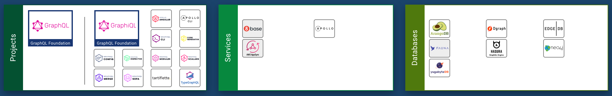

# March 23

Exploring different options for creating a daemon with a [GraphQL][] interface. [Landscape][graphql landscape] is littered with  range of options, exploring it to find best fit.

Here is the wish-list / search criteria:

1. Something like [SQLite][] but with GraphQL API.
2. REPL integration (e.g. [Graph*i*QL][]).
3. Fast.
4. Nothing exotic so it's easy to integrate.
5. Typed (if hooking with DB is on my end).

#### Results of this exploration

- Sadly non of the data base options are simple. They seem to be more on Oracle DB end of spectrum  than SQLite.
- Surprisingly (given that GraphQL itself is typed) not that many typed options:
  - [TypeGraph][] is neat, but extends syntax further (I guess decorators may become standard some day).
  - Tried [GraphQL Nexus][] but API is kind of awkward. Nor type system seem to enforce schema invariants.
  - [Apollo][] appears to be a popular choice (most other things are just a layer no top), but not really designed with TS in mind. Type system does not seem to help ensure resolvers uphold schema invariants.
  - [GraphQL Reference Implementation][] is not a bad choice, but again, type system is not help upholding schema invariants. Also not well documented (which is surprising).
  - [Juniper][] GraphQL server library for Rust. Similar to [TypeGraph][] but in Rust.

I have narrowed  down choices between [TypeGraph][] and [Juniper][], and ultimately decided to go with [Juniper][] + [SQLite][] due to following reasons:

1. It is [well documented][juniper book].
2. I expect Rust to be way faster.
3. Dealing with native node modules is pain.
4. Comes with  [Graph*i*QL][] integration.
5. Compiles to a binary (that is easy to distribute).

Working on initial implementation, with a goal of:

1. Encoding schema (from yesterday).
2. Serving a [Graph*i*QL][] interface.
3. Responding to queries with hard coded results.

Faced some challenges with Juniper on [async-rust][], specifically [unions][] and [interfaces][] seem to not work. Turns out that is [known issue][juniper-union-async-rust], I need to choose between [async-rust][] and not using [unions][] for representing links as `union Link = ReferenceLink | InlineLink` in the schema. Choosing to get rid of unions as they [are awkward and full of boilerplate][] anyway.

[GraphQL]: https://graphql.org/
[graphql landscape]:https://landscape.graphql.org/
[SQLite]:https://www.sqlite.org/
[Graph*i*QL]:https://github.com/graphql/graphiql
[TypeGraph]:https://typegraphql.com/
[GraphQL Nexus]:https://nexus.js.org/
[Apollo]:https://www.apollographql.com/docs/apollo-server/
[GraphQL Reference Implementation]:https://github.com/graphql/graphql-js
[Juniper]:https://graphql-rust.github.io/juniper/current/quickstart.html
[juniper book]:https://graphql-rust.github.io/juniper/current/
[async-rust]:https://async.rs/
[graplql unions]:https://graphql.org/learn/schema/#union-types
[graphql interfaces]:https://graphql.org/learn/schema/#interfaces
[juniper-union-async-rust]:https://github.com/graphql-rust/juniper/issues/549
[are awkward and full of boilerplate]:https://graphql-rust.github.io/juniper/master/types/unions.html "GraphQL union types in Juniper"