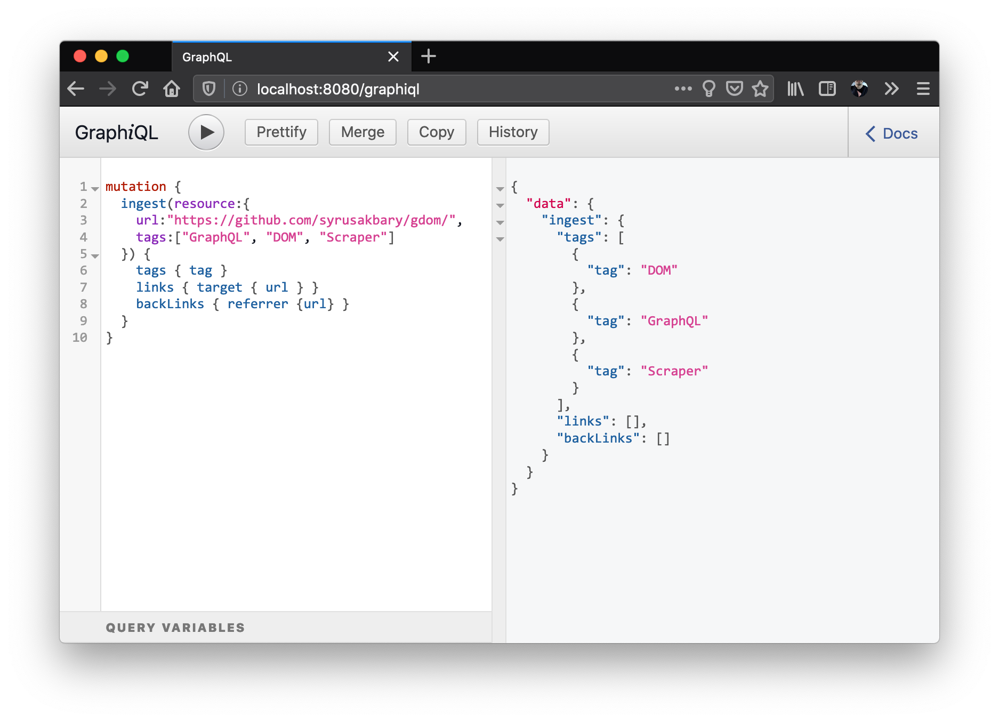

# March 25

Focus today is to implement [mutations][] for the knowledge-server so that clients could submit connections. Conversation with @pvh convinced me that it is best to decouple filesystem scanner from knowledge server itself. With that mutation API will be something along the lines of `{ ingest({url:…, links:…, tags:...}) }`, scanner will use public API to populate database even if it will end up part of the same program.

Implementation turned out to be fairly straight forward, although it did lead to some refactoring as keeping db operations entangled with schema definitions started to get out of hand.

Given a decision that scanner should be decoupled from server, I did a bit of research to figure out what are the available options for doing it in rust. It appears to be following

	- Produce multiple binaries and spawn scanner in its own process.
	- Run scanner in a different thread, that would ease distribution.
	- Bundle multiple binaries and bundle them into OS-specific app via [cargo-bundle][]

Restructured codebase to use shared [workspace][cargo-workspace] where server and scanner are members. This would be compatible with either option and would help avoid coupling.

[mutations]:https://graphql.org/learn/queries/#mutations
[cargo-bundle]:https://github.com/burtonageo/cargo-bundle
[cargo-workspace]:https://doc.rust-lang.org/book/ch14-03-cargo-workspaces.html

