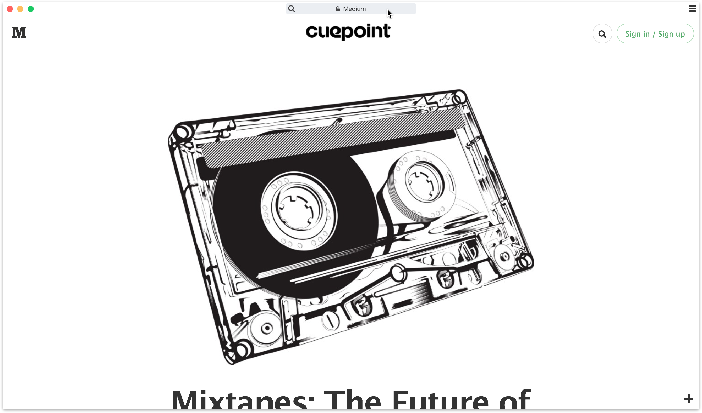
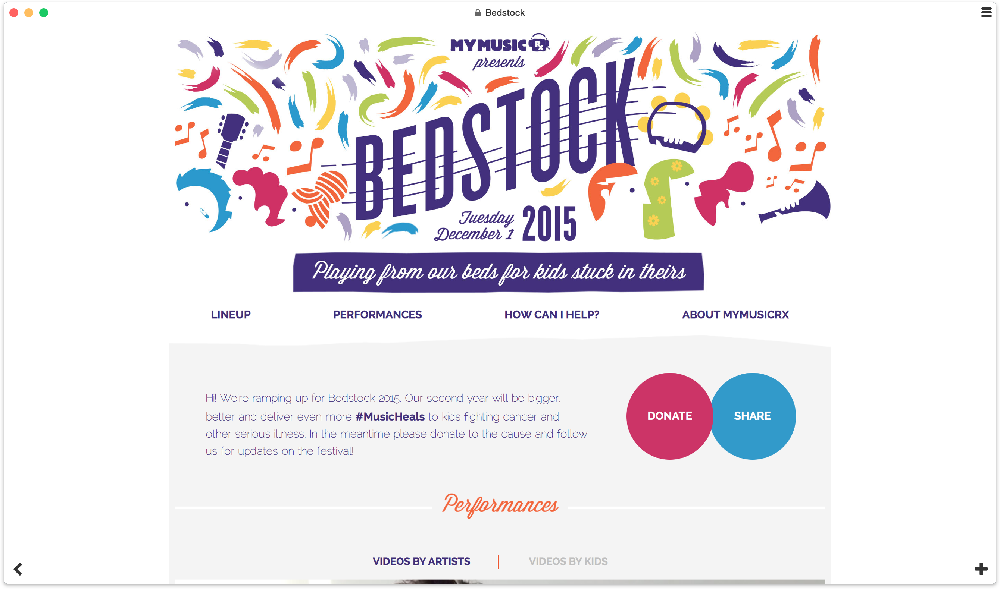
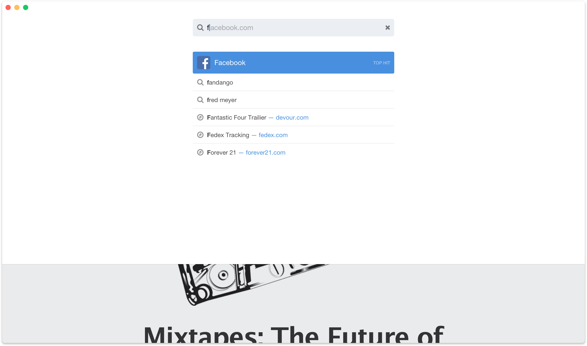
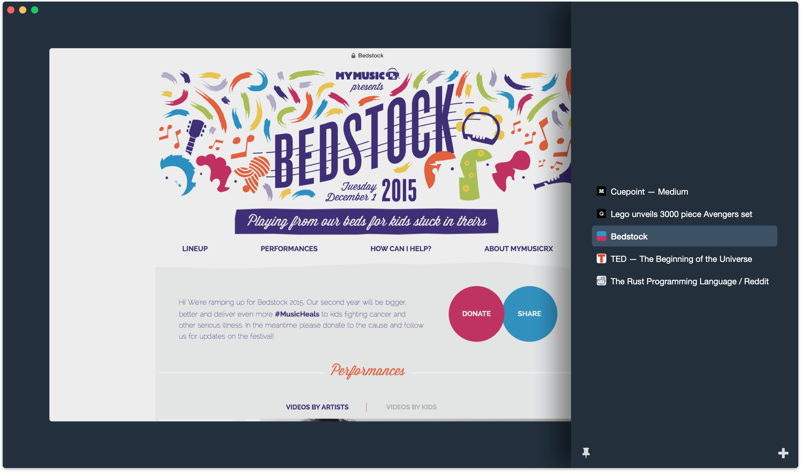

# Perspective UI

We completely redesigned user interface, stepped back from [cards](./web-cards) concept to more familiar tabs model as a default UI for [servo][] nightly builds. 

Introduction of [3D touch][] inspired us to explore a new dimension that could be controlled by a touch pressure. Light touch providing a quick peek at the tabs. Pressure past threshold unveiled full browser chrome.

<video controls loop mute src="./zoom-in-out.mp4"></video>

Demo of touch pressure been used to zoom in / out chrome

In this iteration we opted for more minimal progress bar and spent a lot of time to improving load-time perception it created. Turns out same load time can be perceived as very slow or fast based on how it progresses. 

We made browser chrome more minimal, so it became indistinguishable from the content. We made chrome fade-in when you'd reach for it.

New tab button was added to the right bottom corner overlaying the content. And on the left bottom corner we placed a back button only if there was a page to go back to.

Clicking the site title-bar transitioned it to the editable mode. Input field could be used for entering address, search query or browser command _(everything action hotkey had associated command that you could have invoked)_

Tabs were revealed on [3D touch][], when switching between tabs with `control tab` or via a hamburger button in the top right corner.

We also made it possible to pin tabs as a small sidebar so your tabs would always be at your fingertips.

[servo]:https://servo.org/
[3D touch]:https://developer.apple.com/design/human-interface-guidelines/ios/user-interaction/3d-touch/