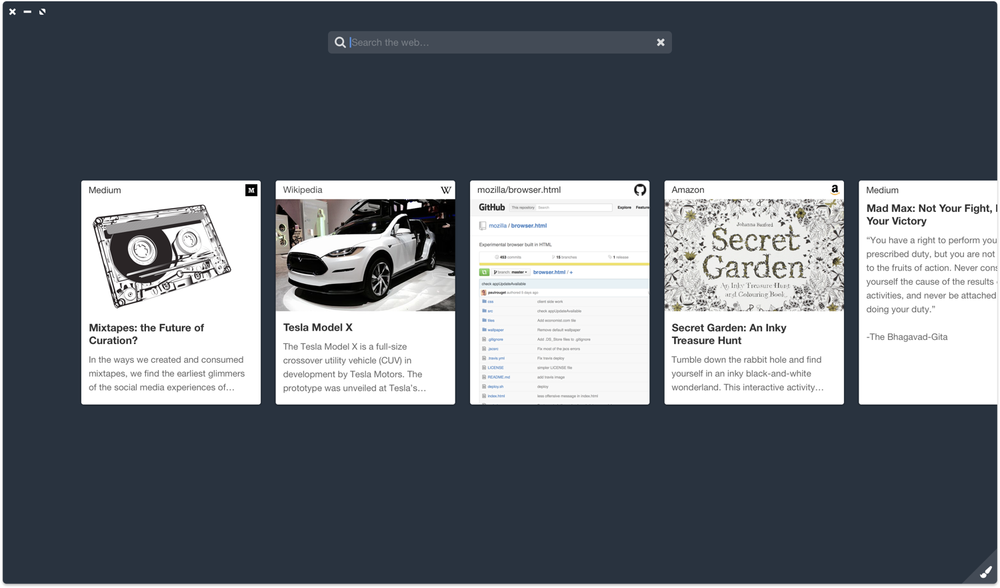
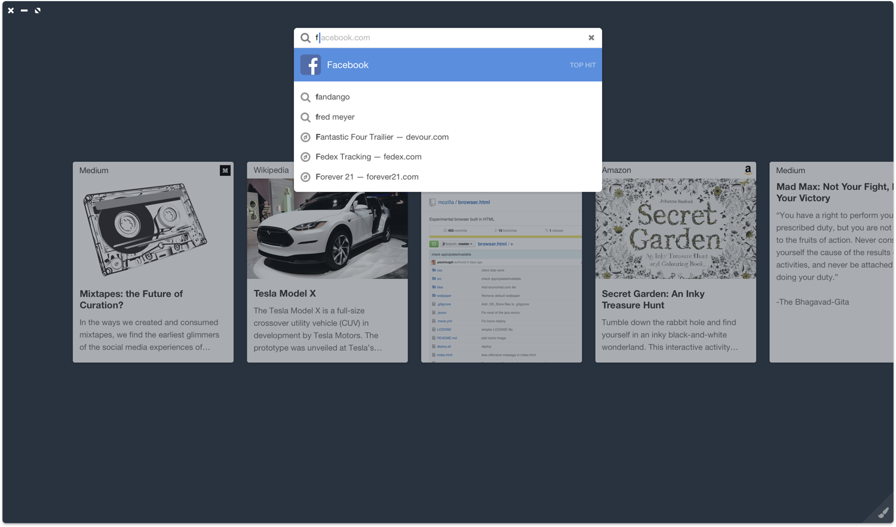

# Web Cards

Concept reimagined tab strip (a.k.a Needle in a Haystack) as a neatly organized, filterable list of cards, each presenting essence of the content. 

<video loop controls mute src="./ElatedDistantDrever.mp4"></video>

Transition from site view to cards view

Just rendering row of card sized pages was not all that useful even if it allowed to do some pretty view transitions. So we moved to scraping metadata from the content to render cards that summarized it.

Address bar turned into a search / filter bar in the cards view. And cards were filtered out to matching ones. Typing URL or search query would instead open up an new card.

In this iteration [@paulrouget][] also introduced idea of picture in picture, which no other browser had at a time. Every browser has it this days and he deserves some credit.

We also carried on the idea of wallpapers (I was not a fan).

[@paulrouget]:https://github.com/paulrouget

