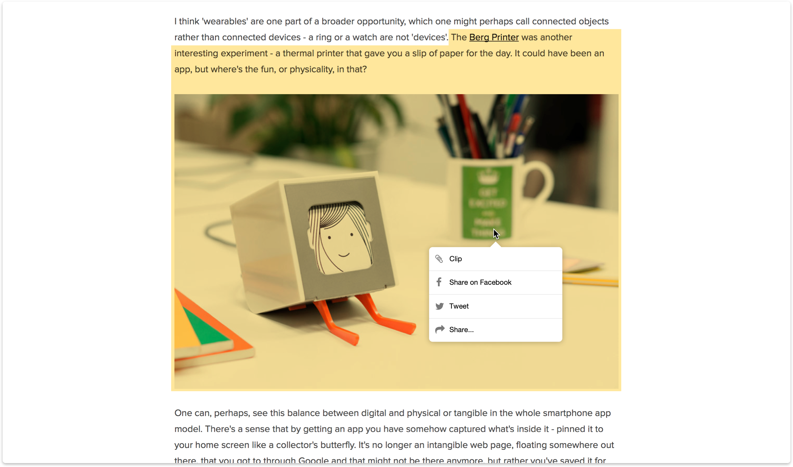
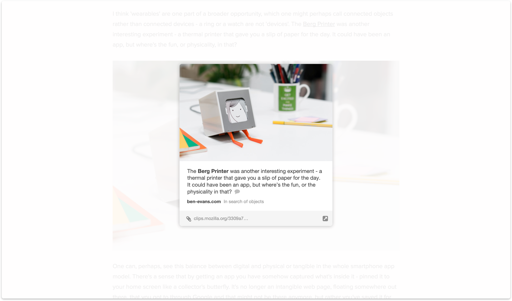

# Web Clips

Browser is a medium for accessing world of information, yet only tool to retain some of it are bookmarks (A long list of addresses that when revisited may or may not load what was bookmarked).

Web clips concept simply allows you to clip anything you like straight out of a webpage. 

Clipped content created a card, building a heat map of what's most important on the web. This was a good fit for the [web cards](./web-cards) concept. These two concepts combined replaced tabs and bookmarks with cards that are much easier to scan through to find what you're looking for.

