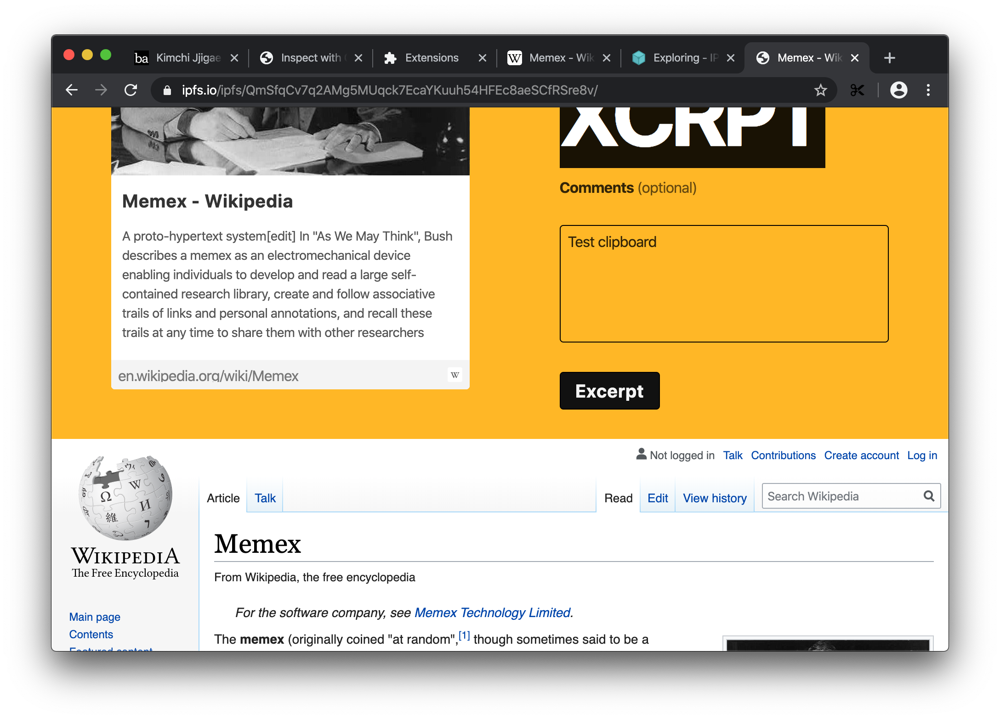

# March 9

While desperately trying to wire all the pieces together, I kept running into issues with [chrome messaging API][extension-messaging]. Initially I could not figure out a way to pass messages from content script or a background script to a UI script loaded in the iframe. Once I did finally figure out the way to do it I kept struggling with another issue.

Turns out message port was getting closed while freeze-dry was archiving page. This end up being a major pain to resolve.

Got publish to IPFS working, which to my surprise, worked out of the box. There is still work to do so that published page looks more like an excerpt and less like a form you have filled, but that should be relatively easy.

[extension-messaging]:https://developer.chrome.com/extensions/messaging