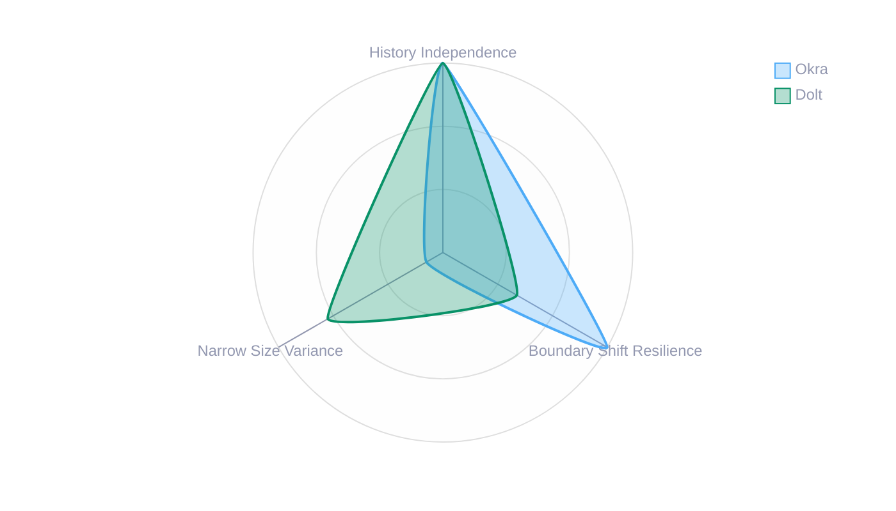
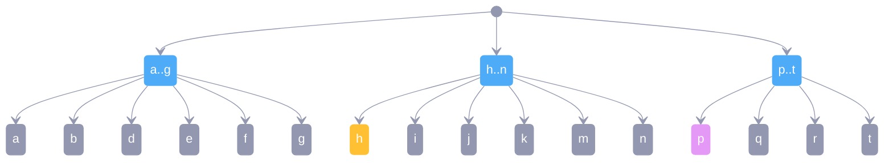
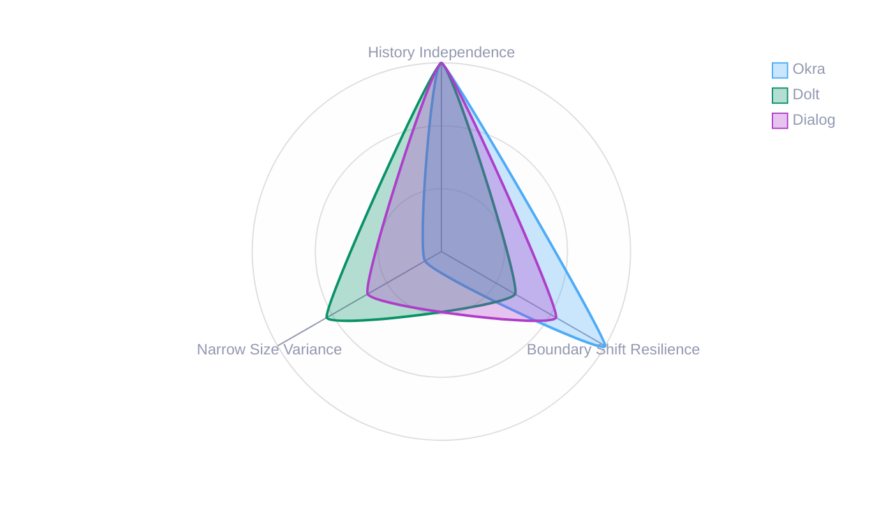

# Improving Size Variance

Dialog DB is designed with [local-first][] principles, aiming to operate without traditional servers by building on content-addressed storage. Like Git, local replicas can cooperate through remote content-addressed stores. To achieve efficient replication in such settings, Dialog uses a search tree algorithm that is [history independent][] and resilient to [boundary shifts][]. Narrowing [size variance][] is currently under exploration and the subject of this article.

## Why Search Trees Matter

Before diving into the specific challenges Dialog faces, let's talk about search trees more broadly. At their core, search trees are data structures that help us find things quickly. Imagine a library - you could pile all books in a heap and search through them one by one, or you could organize them by topic, then by author, creating a hierarchy that lets you find any book much faster. That's essentially what search trees do for data.

In distributed systems like Dialog, search trees become even more critical. Not only do they need to help find data quickly, but they also need to work well when different computers have slightly different versions of the data and need to sync up. This is where things get interesting - and complicated.

## Three Key Properties in Tension

When designing search trees for distributed systems, we care about three main properties that, frustratingly, work against each other:

1. **History Independence**: The tree structure shouldn't depend on the order in which data was added
2. **Boundary Shift Resilience**: Small changes shouldn't cascade through the tree structure
3. **Narrow Size Variance**: Nodes should be relatively uniform in size

You can optimize for two of these, but the third will suffer. For Dialog, understanding these tradeoffs helps us make informed choices about our tree design.

## A Brief Primer on Search Trees

### B-Tree

> In [computer science](https://en.wikipedia.org/wiki/Computer_science), a **B-tree** is a self-balancing [tree data structure](https://en.wikipedia.org/wiki/Tree_data_structure) that maintains sorted data and allows searches, sequential access, insertions, and deletions in [logarithmic time](https://en.wikipedia.org/wiki/Logarithmic_time).

As so many good things, this was also invented in the 70s and is a classic data structure for databases. They work wonderfully in traditional databases but aren't suitable for our purposes: they're not [history independent][]. The tree structure depends significantly on insertion order, and typical rebalancing operations cause [boundary shifts][]. This makes them impractical for Dialog DB.

### History-Independent Trees

#### Merkle Search Trees (MST)

> *A. Auvolat, F. Taïani. (2019) "*[Merkle Search Trees: Efficient State-Based CRDTs in Open Networks](https://hal.inria.fr/hal-02303490/document)*"*

To my knowledge, this is the first published algorithm defining a B-tree that is both [history-independent][] and resilient to [boundary shifts][]. The idea is elegant - hash entries and place them in a tree at a level proportional to the number of leading zeros in their hash. I do however find the insertion/removal algorithm more complicated than those that follow.

Notably, MST has been [incorporated into the @ATProtocol spec](https://atproto.com/specs/repository#repo-data-structure-v3).

### Probabilistic B-Trees

A different approach emerged with probabilistic methods. Instead of rigid rules about tree structure, these algorithms use randomness (derived from cryptographic hashes) to create predictable yet flexible structures.

#### Prolly Tree

Originally introduced in [Noms](https://github.com/attic-labs/noms/blob/master/doc/intro.md#prolly-trees-probabilistic-b-trees) and invented by [Aaron Boodman](https://aaronboodman.com/). The original idea was to apply **content-defined chunking** (CDC) via [rolling hash functions](https://en.wikipedia.org/wiki/Rolling_hash) to delimit nodes into sibling groups. You create nodes from those groups forming a parent layer and repeat until you have a tree. 

Updates are beautifully simple: add or remove a leaf and reapply the chunking logic starting from the affected sibling group. Since tree layout derives from applying CDC on leaves, it's [history-independent][]. The algorithm also inherits resilience to [boundary shifts][] from CDC.

#### Chunky Tree

I was first introduced to these novel search trees by [Mikeal Rogers](https://github.com/Gozala/mikeals-cancer-diaries/blob/832f1952b5a271e04acbf1c3a40995abc7172f2f/best-memories/one-who-cares.md), who [independently came up](https://github.com/attic-labs/noms/issues/3878) with the [Chunky Tree](https://github.com/mikeal/prolly-trees) algorithm. It was remarkably similar to [Prolly Tree][], with the main difference being that entries were delimited into sibling groups by identifying **boundary nodes**, determined from the node's [cryptographic hash][] based on desired branching and probability distribution.

> I suspect the difference in approach may have stemmed from the fact that Mikeal worked on IPLD, where all content was already identified by hash.

After Mikeal discovered [Prolly Trees][], he embraced the name and continued his efforts under it.

#### Okra

[Joel Gustafson](https://joelgustafson.com) recognized a symmetry between [Prolly Tree][] and [Skip List][] if you add an anchoring backbone. The backbone also has the nice benefit of eliminating (leftmost) [boundary shifts][]. **Okra** implements this design and manifests another insight - you can map a [Prolly Tree][] to a key-value store *(that usually would be a B-Tree)*.

> I highly recommend [Merklizing the key/value store for fun and profit](https://docs.canvas.xyz/blog/2023-05-04-merklizing-the-key-value-store.html#key-value-stores-all-the-way-down) as the best introduction to Prolly Trees and their inherent properties that make them a great synchronization primitive in distributed settings.

While the idea of mapping a prolly tree onto a key-value store is brilliant, it [comes with tradeoffs](https://docs.canvas.xyz/blog/2023-05-04-merklizing-the-key-value-store.html#concurrency-constraints) - preventing git-like branching workflows.

> My attempts to come up with a modified mapping strategy that would address this limitation have failed.

#### Dolt

Dolt evolved from the original [Prolly Tree][] idea, optimizing it for SQL databases with Git-like version control. They identified the problem with **[size variance][]** and addressed it with an elegant solution: dynamically adjust the probability needed for a node to be a **boundary node**. They also took inspiration from Mikeal's idea and [switched from rolling hashes to key hashes](https://www.dolthub.com/blog/2022-06-27-prolly-chunker/#rolling-hash-stability).

### Geometric Search Tree (G-tree)

[G-tree](https://g-trees.github.io/g_trees/) is the newest data structure offering similar properties but with an even simpler algorithm. Instead of delimiting nodes into sibling groups at every level of the tree, you assign geometrically chosen [ranks](https://g-trees.github.io/g_trees/#rank_informal) and treat them as the node's vertical position. Same-ranked adjacent nodes form sibling groups. Geometric distribution can be [simulated from entry hashes](https://textile.notion.site/Flipping-bits-and-coins-with-hashes-205770b56418498fba4fef8cb037412d).

#### Search Tree in Dialog

Dialog's search tree implementation is based on the [G-tree][] algorithm. It slightly diverges from the paper by pushing entries into a leaf layer. In that regard, it's more similar to [Okra][] in terms of layout. However, unlike Okra or other [prolly tree][] variants, we don't need to detect boundaries in the upper levels of the tree by node hashes - we can do it by comparing the rank of the leftmost leaf to the tree height. If they're not the same, it's a boundary.

## Visualizing the Tradeoffs

Different search tree implementations make different choices about which properties to prioritize:



As you can see, Okra maximizes history independence and boundary shift resilience but allows significant size variance. Dolt improves size variance but sacrifices some boundary shift resilience.

### Understanding These Properties

#### History Independence

> In a history-independent data structure, nothing can be learned from the memory representation of the data structure except what is available from the abstract data structure.

More simply: if the structure of the tree is independent of insertion order, it's [history independent](https://dl.acm.org/doi/10.1007/s00453-004-1140-z). This property matters for synchronizing uncoordinated changes. Without it, we'd struggle to efficiently find differences between replicas - we'd have to scan entire subtrees that merely *look* different due to insertion order.

> For a while, I thought of history independence as binary - you either have it or you don't. But it's better to think of it as a spectrum. How much drift from perfect independence can we tolerate while still efficiently identifying differences?

#### Boundary Shift Resilience

The stronger the resilience to boundary shifts, the smaller the impact of a random edit. To illustrate: we could delimit nodes into fixed-size groups and build a tree that way. This would give us perfect [history independence][] and perfectly narrow [size variance][], but terrible boundary shift resilience - inserting a single entry would shift everything to its right.

On the other hand, [Okra][] has perfect [history independence][] and high resilience to [boundary shifts][]:

> Making a random change in our key/value store with 16 million entries only requires changing a little less than 7 merkle tree nodes on average.

In distributed settings, resilience to boundary shifts helps reduce redundant network roundtrips and cache invalidations.

#### Size Variance

I'm deliberately vague about what "size" means - it could be the [branching factor](https://en.wikipedia.org/wiki/Branching_factor) (the size of sibling groups) or the byte size of serialized nodes. Often there's high correspondence between the two. 

High variance makes performance unpredictable - some nodes end up huge while others are tiny. The search trees mentioned here (except traditional B-Trees) tend to compromise on this property to gain the first two. While boundaries detected from cryptographic hashes should theoretically produce balanced distributions, there are no guarantees in practice.

> In Dialog, while nodes tend to be **on average** of the desired density, variance is high and the median is far from the average. This is something we'd like to address.

## Calibrating Tradeoffs

### Strengthening Size Variance

Authors of Dolt came up with a clever yet simple solution - correlate probability with size.

> I'll describe the idea conceptually to build intuition. For accurate details, see [Dolt's article](https://www.dolthub.com/blog/2022-06-27-prolly-chunker/).

Say we want to divide nodes into sibling groups led by a **boundary** node. We determine that to get **on average** `Q` sized groups, a boundary node needs a hash starting with `n` zeros. Instead of keeping `n` static, we decrease it as our group nears the desired size. Once we have `Q/2` siblings, we decrement `n`, improving the probability of finding a boundary.

If we find a boundary before reaching the "pressure zone," we have a strong/permanent boundary. If we find it in the pressure zone, we've compromised our requirements slightly, resulting in a **weaker** boundary.

### The Cost: Weakening Boundary Shift Resistance

Strengthening [size variance][] requires weakening resilience to [boundary shifts][]. Let me illustrate with an example:



Yellow nodes are weak boundaries, purple are permanent boundaries. When we insert `c`, the group exceeds the pressure threshold, causing `f` to become a boundary. This shifts nodes into the next group, potentially cascading through multiple groups until hitting a permanent boundary.

The insight: weak boundaries depend on context (like group size) to meet selection requirements. When context changes, they may no longer qualify, allowing shifts to cascade. Permanent boundaries, however, don't depend on context and stop cascades.

### Alternative: Weakening History Independence

We could also strengthen [size variance][] by weakening [history independence][] instead. Rather than allowing shifts, we could create new groups when pressure builds, but this means insertion order affects tree structure - the same data inserted in different orders produces different trees.

> While [history independence][] is weakened, I don't believe it's completely compromised. My intuition is that permanent boundaries guide convergence rather than divergence, though it seems possible to construct contrary scenarios.

## Dialog's Approach: Leveraging Natural Data Boundaries

For Dialog DB, we're exploring an approach inspired by Dolt's but preferring more resilience to [boundary shifts][] at the cost of more [size variance][]:



### Why Different Tradeoffs?

Traditional databases optimize for query speed - consumers send queries to a provider that executes and responds. DialogDB is local-first: consumers execute queries locally against partial replicas. If a query needs subtrees not available locally, they're pulled from remote archives over the network.

This difference affects our design choices:

- **Shallow trees help**: Each level requires a network round trip
- **Larger nodes can be beneficial**: One 64KB fetch might be faster than four 16KB fetches
- **Stable boundaries improve caching**: Shifts invalidate cached paths
- **Natural data boundaries improve locality**: Related data stays together

### Our Approach: Natural Data Boundaries

Instead of forming boundaries purely on size-based heuristics, we're exploring whether we can leverage the natural structure in data. Dialog's search tree keys comprise:

- Index Identifier (EAV, AEV, or VAE)
- Entity Identifier
- Attribute Namespace
- Attribute Name
- Value Type
- Value

Natural boundaries exist where these components change:

```
EAV   ba4...b46q   pokemon name          string     delibird
EAV   ba4...b46q   pokemon stat/speed    uint       55
EAV   ba4...b46q   pokemon stat/attack   uint       55
EAV   ba4...amkh   pokemon name          string     volcanion
EAV   ba4...dbiq   todo    title         string     shopping list
AEV   pokemon      name    ba4...b46q    string     delibird
```

Splitting where the index changes (EAV → AEV) or namespace changes (pokemon → todo) could create boundaries that:

1. **Match query patterns**: Queries often access data within the same namespace
2. **Stay stable**: New Pokémon data wouldn't shift the todo boundary
3. **Keep related data together**: Improving cache efficiency

### Implementation

Our algorithm distinguishes between:

1. **Strict delimiters** - Boundaries from geometric distribution
2. **Forced delimiters** - Applied at max capacity, chosen at natural data boundaries

When forced splits are necessary, we choose the node with the most semantically different key from its siblings. This approach aims to improve cascade resistance, query locality, write locality, and network efficiency.

## Why This Matters for Dialog

For our use case with on-demand partial replication:

- **Stable boundaries** reduce cache invalidation
- **Semantic boundaries** improve prefetch efficiency
- **Larger node tolerance** reduces tree depth
- **Natural locality** minimizes network requests for related data

The occasional large node at a namespace boundary is preferable to frequent boundary shifts that scatter related data across multiple network requests.

> Dolt's approach using cumulative distribution functions has proven very effective. [Wil Chung's analysis](https://interjectedfuture.com/lab-note-033-cascading-boundary-changes-in-prolly-trees/) shows that relaxing size variance improves boundary shift resilience. It may be that their approach alone produces results as good as or better than our speculative approach - we'll need to evaluate them side by side.

[history independent]:#history-independence
[history independence]:#history-independence
[boundary shifts]:#boundary-shift-resilience
[B-Tree]:https://en.wikipedia.org/wiki/B-tree
[local-first]: https://www.inkandswitch.com/essay/local-first/
[Prolly Tree]: #prolly-tree
[Skip List]: https://en.wikipedia.org/wiki/Skip_list
[Okra]:#okra
[size variance]:#size-variance
[cryptographic hash]:https://en.wikipedia.org/wiki/Cryptographic_hash_function
[SSB]:https://ssbc.github.io/scuttlebutt-protocol-guide/