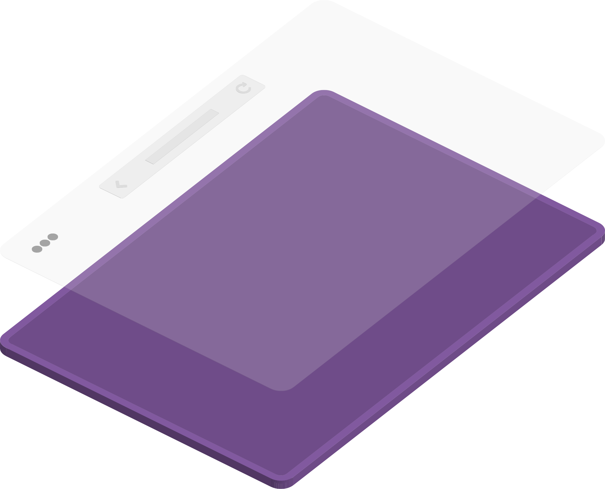

# Graphene

In the early days of the project we developed a concept of a web runtime, designed to be thinnest possible layer for the web. Runtime would take URL to an HTML, would load (and cache) it as it's user interface. 

Empowering users to (re)shape their User Agent was the vision. But it also supercharged browser concept development and we kept it even as we switched web engine from [gecko][] to [servo][]. This also meant that deploying update was just `git push` away (as demonstrated in video below) and applying update did not require restarts, in fact even tabs were not reloaded.

<video autoplay loop controls mute src="browser-update.mp4" />

There was also a setting in `about:config` to configure URL for the UI. However our update mechanism assumed UI was hosted on github.

[gecko]:https://en.wikipedia.org/wiki/Gecko_(software)
[servo]:https://servo.org/

