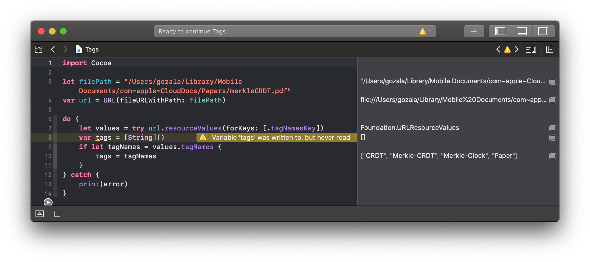
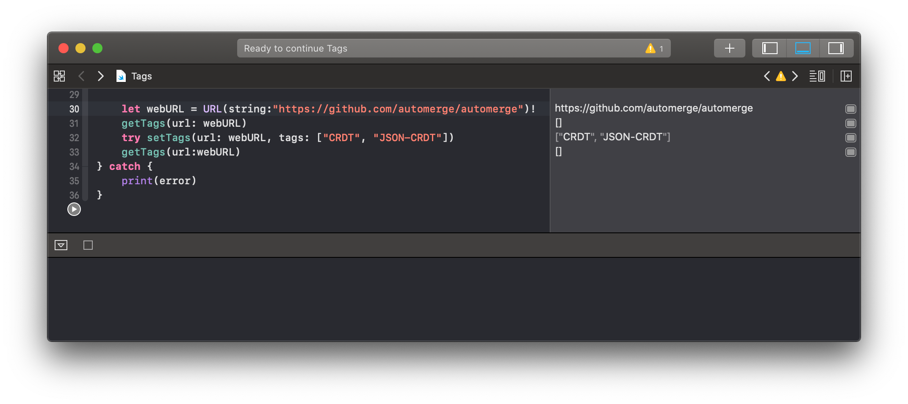

# March 18

Over night I got a realization that MacOS already has concept of tags across the filesystem. Which if I recall correctly from @gordonbrander's workshop he uses extensively. It would make a lot of sense to leverage OS tagging system and see how far can we take this.


Looking into if what are the ways to tap into MacOS tagging:

- Found https://github.com/jdberry/tag CLI tool for MacOS filesystem tagging and querying by tags.
- Apple user [guide to folder and file tagging][tag-files-and-folders]
- [NodeJS module for reading/writing tags on file][osx-tag]

Turns to get file tags, you need to create a `file://` [NSURL][] and get a resource property via [`getResourceValue`][] for [`tagNamesKey`][] key:



Investigating if this works for non `file://` URLs, if it does work we could exploit this to tag pretty much anything. If it does not we could probably create link files (something along the lines of windows shortcuts).



<center>Tags for non file URLs are not preserved.</center>


It does not appear to me that there is a standard way to persist tags for non `file://` URLs on MacOS. So I thought alternative could be to create a shortcut file for the URL which if I recall correctly was a thing. After some digging I found [unofficial specification for URL file format][URL File Format] and sure enough clicking `automerge.url` file with below content loads it into default browser:

```ini
[InternetShortcut]
URL=https://github.com/automerge/automerge
```

 I think we could use regular Mac APIs for tagging `file://` URLs and generate `.url` files for tagging `https://` URLs. Name of the file could be derived from the URL itself. In practice it does not seem better that having a data base, so I'm not sure if there is much value in creating `.url` files.

It also appears that putting data URL into  `.url` file does not work. I thought it might be a neat way to save web-annotations, but I'm also tired and don't seem to think straight.


[guide for tagging]:https://support.apple.com/guide/mac-help/tag-files-and-folders-mchlp15236/mac
[osx-tag]:https://www.npmjs.com/package/osx-tag
[NSURL]:https://developer.apple.com/documentation/foundation/nsurl
[`tagNamesKey`]:https://developer.apple.com/documentation/foundation/urlresourcekey/1410718-tagnameskey
[`getResourceValue`]:https://developer.apple.com/documentation/foundation/nsurl/1408874-getresourcevalue
[URL File Format]:https://ipfs.io/ipfs/QmUJiTuH7ANkZZuBXe5N8ckbFFZcNYzKkwVk3igwAqgvPG/
[tag-files-and-folders]: 