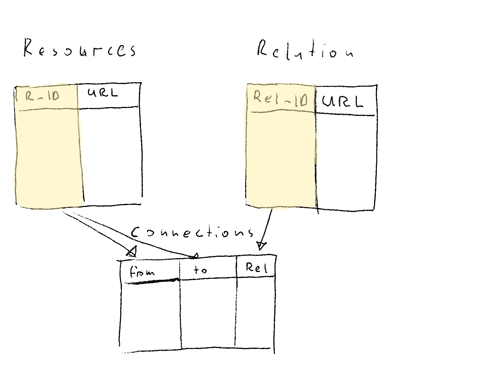

# March 19

Trying to figure out how to query MacOS for tags. Indexing doesn't seem like a great solution as it can get out of sync. Was reading on [finda][] to see if I can learn trick or two from them.

> Finda uses vectorized CPU instructions and bitmap indexes to search in-memory results, and never waits on the disk or network.

In an attempt to find whether windows has something along the lines of MacOS tags came across the [FileMeta project, that seems to exploit NTFS property data][windows metadata], which suggest there might be a way to do across OS.

Looking into [Apollo][] to see if that would be a good fit for KSP storage.

----

Describing Knowledge Server behavior and it's effects

- Server listens for submissions and queries

- FileSystem sub-component watches filesystem & submits connections

  - Identifies connections in `*.md` files e.g. (`file:///Users/gozala/Notes/farm.md`) and submits those to the server. Recognizing following
    - Encountering reference link e.g `[local-first]:https://www.inkandswitch.com/local-first.html` it does following
      - Tags `file:///Users/gozala/Notes/farm.md` as `local-first`
      - Tags `https://www.inkandswitch.com/local-first.html` as `local-first`
    - Encountering inline link e.g. `[automerge](https://automerge.github.io/)`
      - Tags `file:///Users/gozala/Notes/farm.md` as `https://automerge.github.io/`

  

With a following db schema it would lead to the following tables
  

| URL_ID | URL                                           |
| ------ | --------------------------------------------- |
| 1      | file:///Users/gozala/Notes/farm.md            |
| 2      | https://www.inkandswitch.com/local-first.html |

| Tag_ID | Tag                          |
| ------ | ---------------------------- |
| 1      | local-first                  |
| 2      | https://automerge.github.io/ |

| Tag_ID | URL_ID |
| ------ | ------ |
| 1      | 1      |
| 1      | 2      |
| 2      | 1      |

There are several things I do not like about this:

- `file:///Users/gozala/Notes/farm.md` and `https://www.inkandswitch.com/local-first.html` are related now but only through a tag `local-first`. Maybe that is fine, but it also appears that relation semantics are lost.
- Tagging  `file:///Users/gozala/Notes/farm.md` via `https://automerge.github.io/` starts to feel like overloading tags.
- `https://automerge.github.io/` is a URL but is in the tags table instead. 

This is leading me to think that we also need URL to URL associations so that we are not overloading tags.  But then what we actually have with markdown files is two kind of relationships:

  1. Reference links that are tagged (named) connections
  2. Inline links that are anonymous (untagged) connections

Abstracting this a bit we arrive to the DB schema of related resources with some semantics. Relation semantics had being tags so far, but that is also why I think we started to loose semantics in first place. 

By  allowing arbitrary relation semantics system becomes more flexible. e.g We want XCRPT tool to associate excerpt with original resource, and XCRPT tool itself so user could find all the excerpts created. That meant that XCRPT tags excerpt with original page URL and `XCRPT` tag to be able to discover all excerpts, but it makes more sense to relate excerpt with source page via `XCRPT` semantics. In other words origin page `https://www.bonappetit.com/recipe/kimchi-jjigae` is related to excerpt `https://ipfs.io/ipfs/QmS1pj7nUBvCSTaMjSrtH1EYfhWWpr4sZFyfdi7zfAm5Wc/` via `https://xcr.pt` semantics.

#  Oh my [RDF][] 😱

[RDF]:https://en.wikipedia.org/wiki/Resource_Description_Framework
[windows metadata]:https://ipfs.io/ipfs/Qma526mHu5XsCp1Xqj67KT4ZgFXH9KBXXogf96ZNY8VZE2
[finda]:https://keminglabs.com/finda/
[Apollo]:https://www.apollographql.com/