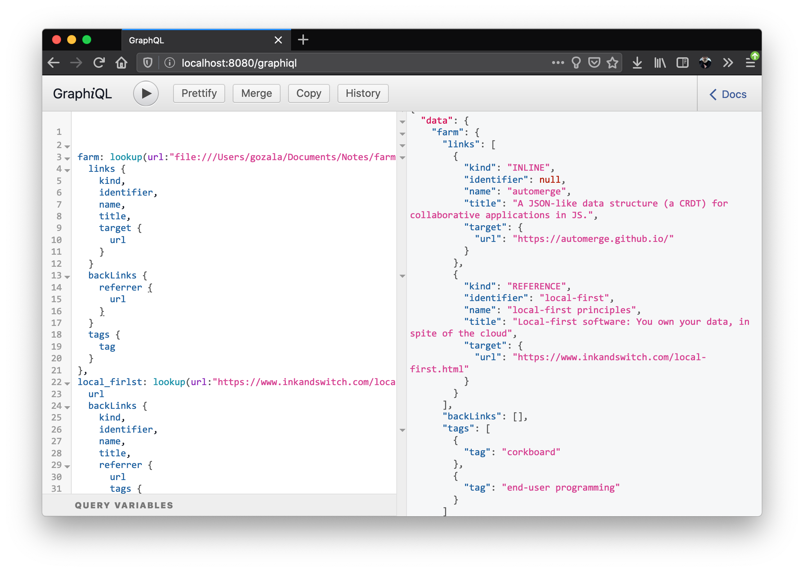

# March 24

Finally got implementation serving hard-coded data working. Focusing today to hook it up with [SQLite][]. My [SQL][] got pretty rusty, pun intended, although what I meant is while I remember what I could do and do not exactly remember how. Anyway here is the the table schema I have settled on

```sql
CREATE TABLE IF NOT EXISTS inline_links(
  referrer_url Text NOT NULL,
  target_url Text NOT NULL,
  name Text,
  title Text
);

CREATE INDEX IF NOT EXISTS idx_inline_links ON
  inline_links (target_url, referrer_url, name, title);

CREATE TABLE IF NOT EXISTS reference_links (
  referrer_url Text NOT NULL,
  target_url Text NOT NULL,
  identifier Text NOT NULL,
  name Text,
  title Text
);
CREATE INDEX IF NOT EXISTS idx_referrer_links ON
  reference_links (target_url, referrer_url, identifier, name, title);


CREATE TABLE IF NOT EXISTS tags (
  target_url Text NOT NULL,
  tag Text NOT NULL,
  PRIMARY KEY (target_url, tag)
)
WITHOUT ROWID;
CREATE INDEX IF NOT EXISTS idx_tags on tags (target_url, tag);
```

I was trying to use [SQLx][] library (as it was designed around async/await), but it is not well documented, [SQLite][] support has not being released yet and I kept running into issues. Gave up and switched to [Rusqlite][] instead. That has not being problem free either, from what I understand [async-rust][] employs thread-pool, but DB connections can be shared across threads. [Rust ownership][] checker points that out and prevents compilation. I figured out that problem could be addressed using [`Mutex`][Mutex]-es. End up using [r2d2][] connection pool (that I'm guessing uses [`Mutex`][Mutex]es under the hood). 

Finally got querying part implemented and hooked with data base (populate db with data manually).

Things that I'm still actively thinking about:

- When you start the KS what path should it ingest ?
- What to do when you restart the server. Should it reindex (things could have changed while it was not running) ? Rescanning all files seems like a huge overhead on every startup. 
- Do we ingest all of the web as you browse (I am not sure seeing all the links between all the pages you've visited is all that useful) ?
- How do we spot similarities between documents ?


[SQLite]:https://www.sqlite.org/

[SQL]:https://en.wikipedia.org/wiki/SQL "Structured Query Language"
[SQLx]:https://github.com/launchbadge/sqlx
[Rusqlite]:https://github.com/jgallagher/rusqlite
[Rust ownership]:https://doc.rust-lang.org/1.8.0/book/references-and-borrowing.html
[Mutex]:https://doc.rust-lang.org/std/sync/struct.Mutex.html
[r2d2]:https://crates.io/crates/r2d2