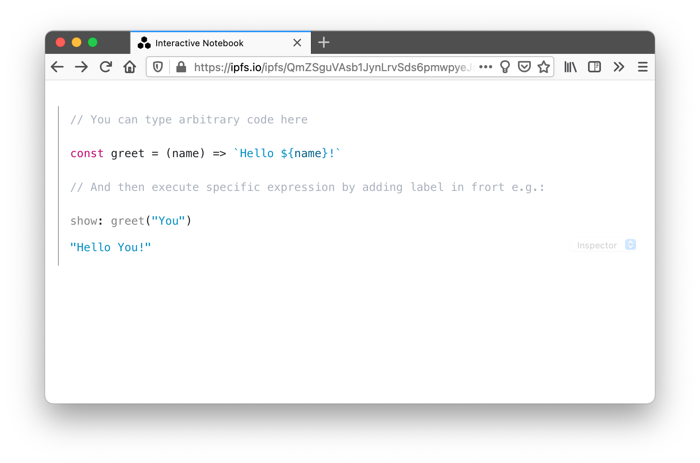
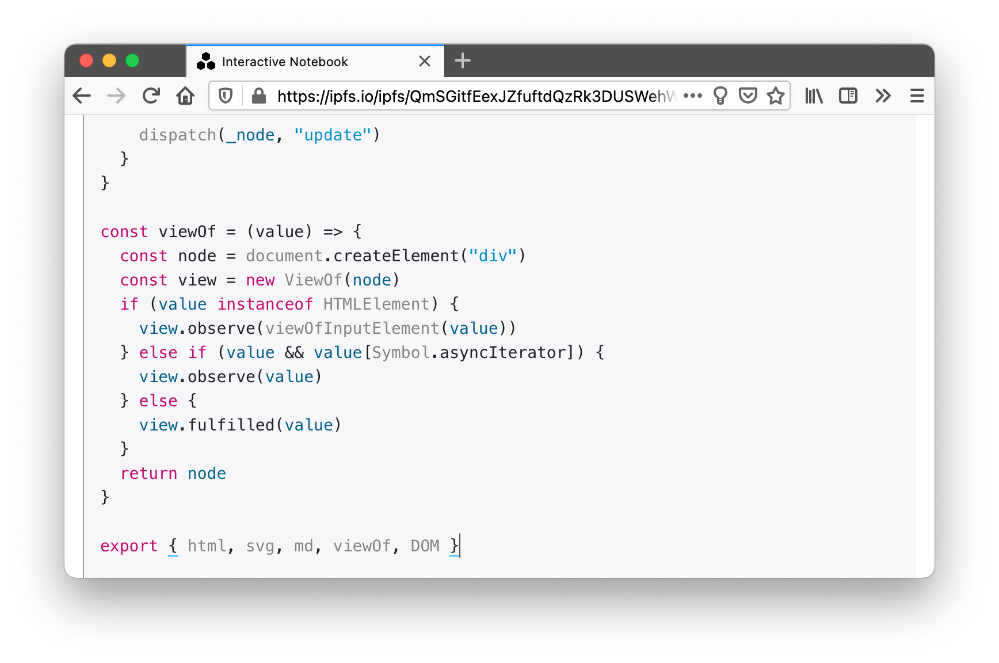

[Protocol Labs][] hacks week provided an opportunity to work on a tool I call [replicator][]. It is an interactive notebook - JS live coding environment. It borrows some ideas and code from [observablehq.com](), but it is also different in many ways.

> It is not a first time I am finding myself building such a tool. If anything it is a spiritual successor of [interactivate][].




Replicator *does not have cells*. Instead you can [label][js label] expressions and their results will be rendered inline below. This way content of the notebook is all valid JS (yes it is legal to label expressions). There is no UI controls to fiddle with or keyboard shortcuts to remember.


Tool is written as a collection of static files *(HTML, JS, CSS)*. This enables simple deployment by adding directory of files to [IPFS][] network.

> This is my release script
>
> ```shell
> ipfs add --quieter --recursive replicator
> ```

Replicator also operates JS-IPFS node *(more about this in a bit)*, which it can use to pick its own internals. Picture below shows capturing own Content Identifier ([CID][]) from the location, and use of IPFS to read `./data/code.js` path from within it.


When tool loads, it reads contents from (that same) `./data/code.js` path and loads it into the live coding environment. After making some changes and pressing red save button, it adds code to the  [IPFS][] and swaps page location from [`QmZS…Sy6y`](https://ipfs.io/ipfs/QmZSguVAsb1JynLrvSds6pmwpyeJq28t7PdLnhSfx1Sy6y) to a new replica at [`Qmco…phb1`](https://ipfs.io/ipfs/QmcoqByzFYXHVs779kuJtjRrZ1FmcoCSeL9ws6hS7Pphb1/)

Comparing underlying [Merkle DAG][]s of replicas reveals that two only differ in `data` link *(2nd from the top)*. That is because when you click save, replicator saves code as a `code.js` file wrapped in a directory and adds it to [IPFS][]. Then it saves a copy of an own root node with `data` link swapped, pointing that new content. Due to the deduplication enabled by content addressing all replicas will end up sharing all of the replicator code 🎉

 

Replicator supports (native) JS modules, which means you can import them. 

> In fact all of the replicator code is loaded as unbundled raw JS modules. I have to attest that, free of complicated toolchains, JS is, as fan, as it used to back in old days!

Screenshot shows importing slightly altered version of [@observablehq/stdlib][] from IPFS to render some markdown.


All together replicator is live coding environment. You can explore ideas and share them as forked replicas with others. Code you type is valid JS file on IPFS and therefor replicas can import code from one another. No package management needs and it's all content hash addressed.

 

Replicator uses a self forking trick to save what you have typed! In fact, I wrote that feature, interactively, in a replica that did not had that feature yet ♻️ Now how meta is that ?!


### Wish List

- There is an [IPFS Pinning Service API][] that allows you to add pinning services (kind of like git remotes) and push pins to them. I would like to integrate them into replicator so that people (myself included) can save replicas.

- Importing modules from IPFS gateway URLs with hashes is bad. For one it makes replicas not fully self contained and second gateway should have no role here.

  Solution here is to do a similar brain surgery as with save. Specifically it would be adding a DAG link e.g. `/data/modules/automerge.js` for imports. Not only that would make all imports part of the new replica but it also would remove ugly hashes from imports.

- At the moment forks do not point to replicas they diverged from. It would be fairly easy to add that feature and I think it is a good idea (still debating).

- At the moment when I publish new version of replicator it has no DAG Link to the previous version. I think it should as it would make the whole brain surgery thing even more meta by giving you access to all previous versions of it.

- I do not want to turn it into IDE or a multi file editor, but then I also kind of do 🤔 What I really want is some neat way to allow it to load it's internal code so you could do brain transplants and sharing a lot easier. 

  I do not however want a file tree view and can't seem to figure out right UX for this. Best I could think of is a command bar.

- I really wish I have used [codemirror@6][], I have not because I have scavenged bunch of code from some of my other explorations. Trying a new codemirror could have turned into a time sink so I chose to focus on other pieces (I am glad I was able to resist temptation).


[reactivity example]:https://ipfs.io/ipfs/QmYp5ef6y8pWgzwgsXRcpkWBRk1qHbAxpJC1rcBVDCDMDd
[Protocol Labs]:https://protocol.ai
[replicator]:https://github.com/gozala/replicator
[observablehq.com]:https://observablehq.com
[interactivate]:../interactivate/
[js label]:https://developer.mozilla.org/en-US/docs/Web/JavaScript/Reference/Statements/label
[CID]:https://docs.ipfs.io/concepts/content-addressing/#identifier-formats
[IPFS]:https://ipfs.io/
[Merkle DAG]:https://proto.school/merkle-dags
[@observablehq/stdlib]:https://github.com/observablehq/stdlib
[IPFS Pinning Service API]:https://ipfs.github.io/pinning-services-api-spec/


[codemirror@6]:https://codemirror.net/6/