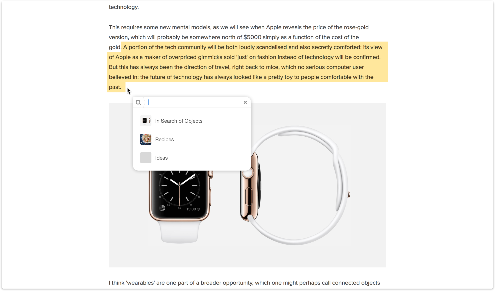

# Web Highlighter

Evolving bookmarks into something useful was a high priority. More you had, harder it was to find the one in the wall of text. [User research][] showed that people wanted to save, synthesize and share (fragments of) content, in fact most resorted to screenshots to do just that.

Web highlighter concept was an exploration of a simple idea: Add any selection from the web to your collection and share some with others.

Collect

Share

[user research]:https://github.com/browserhtml/browserhtml/releases/tag/0.15.0

