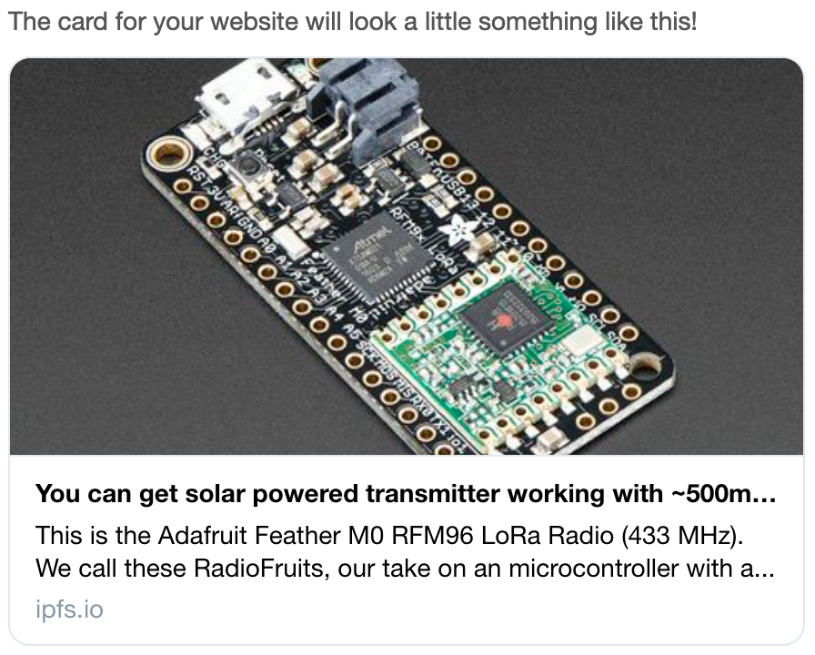

# March 11

### Content Height

Spend more time trying to find a solution for inadequate content height. In the end settled on idea of mitigating an issue by adding `min-height: 100vh` which should work in many cases where height is under reported.

### Unfurl

Implemented unfurl interaction for excerpts, so that captured selection can be presented. I wanted excerpts to be JS free, but use of `iframe` made it impossible. I did considered use of anchor links that target iframe `<a href="#xcrpt" target="archive">unfurl</a>` but that seems to cause page reloads instead. Instead I end up adding anchor link to an iframe that included JS intercepts to scroll to content and recreate the selection.

<video src="unfurl-v1.mov" mute controls></video>

### Annotations Embedded as JSON-LD

To implement unfurl script on recreating annotation needs a way to know what selection to recreate, meaning it needs to be captured such that script can access. I have chose to [embed web annotation as JSON-LD](https://ipfs.io/ipfs/QmVPqcmNo4iQ9uvQnREQyXAJeMHv5HfMTa6zqf7DbUWK41/) which script can then decode to recreate a selection

```html
<script
        id="web-annotation"
        type="application/ld+json;profile=&quot;http://www.w3.org/ns/anno.jsonld&quot;">
{
  "@context": "http://www.w3.org/ns/anno.jsonld",
  "type": "Annotation",
  "id": ".",
  "created": "Thu, 12 Mar 2020 18:25:12 GMT",
  "generator": "https://xcr.pt",
  "motivation": "bookmarking",
  "body": [],
  "target": {
    "source": "https://en.wikipedia.org/wiki/Memex",
    "selector": [
      {
        "type": "CssSelector",
        "value": "#mw-content-text > div:nth-child(1) > p:nth-child(7) ",
        "refinedBy": {
          "type": "RangeSelector",
          "startSelector": {
            "type": "TextPositionSelector",
            "start": 0,
            "end": 0
          },
          "endSelector": {
            "type": "TextPositionSelector",
            "start": 553,
            "end": 553
          }
        }
      }
    ],
    "state": {
      "type": "TimeState",
      "cached": "./archive.html",
      "sourceDate": "Thu, 12 Mar 2020 18:25:12 GMT"
    }
  }
}
</script>
```

### Open Graph Metadata

Twitter, Slack, Messages and others all tap into html metadata to generate cards for posted links. Most seem have to converged on [Open Graph protocol][] to do so, although some e.g. twitter [provide additional metadata][twitter cards]. I have spend time to ensure that excerpts contain all the necessary metadata to render all the relevant details e.g. use provided comment as a title so both comment and summary are rendered on social platforms.

Despite tools like [twitter card validator][] rendering as expected, actual twitter and slack seemed to not work or omit images. 



After lot of trial and error, issue turned out to be the fact that applications did not liked relative URLs nor `data:` urls for images. On the other hand using absolute URLs are incompatible with content addressability of IPFS as we are unable to derive content hash as html embedding it needs to be part of it. (There are way around it like uploading image first and using that URL, but whole absolute URL requirement seems pretty frustrating).

In the end I have settled on using original image URL for as a short term solution. Long term we might want to use actual IPFS interface instead of simplistic [Pinata API][]


[JSON-LD Annotation]:https://ipfs.io/ipfs/QmVPqcmNo4iQ9uvQnREQyXAJeMHv5HfMTa6zqf7DbUWK41/
[Open Graph protocol]:https://ogp.me/
[twitter cards]:https://developer.twitter.com/en/docs/tweets/optimize-with-cards/guides/getting-started
[twitter card validator]:https://cards-dev.twitter.com/validator
[Pinata API]:https://pinata.cloud/documentation